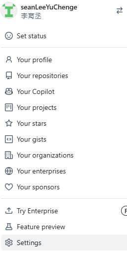
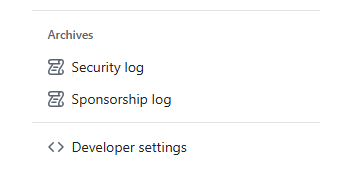
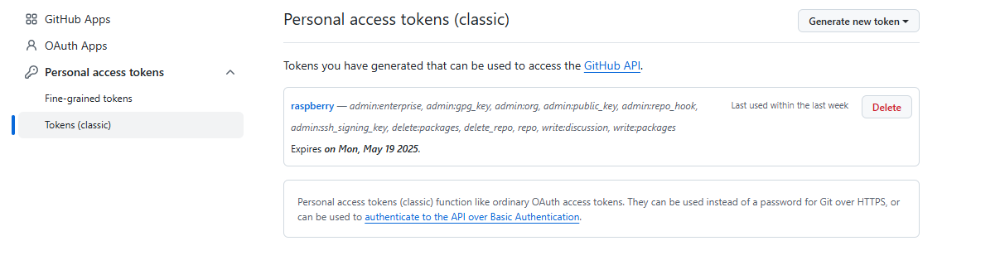
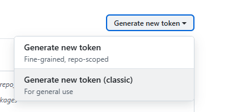
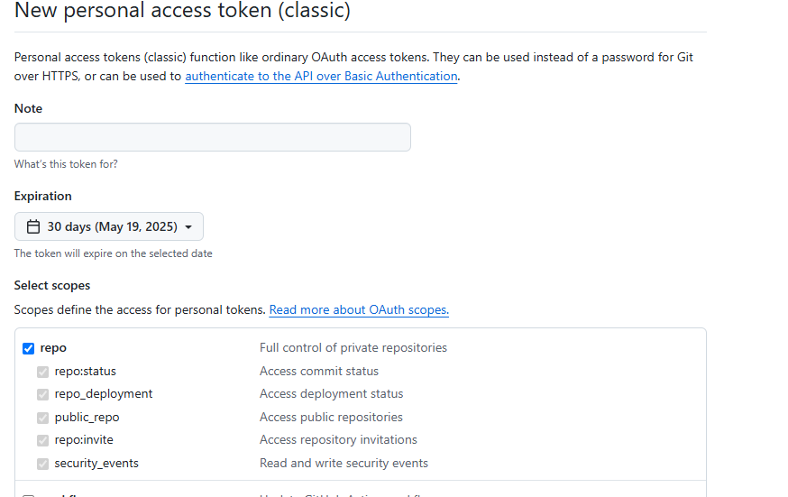
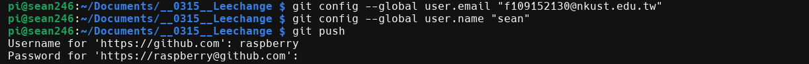

## 🔧Git 初始化與設定
    ```bash
    1. git init                     # 初始化一個新的 Git 倉庫
    1. git config --global user.name "你的名字"
    1. git config --global user.email "你的信箱"
    1. git config --list           # 檢查目前 Git 設定

## 📂 專案操作
    ```bash
    1. git clone [URL]   

## 📦版本控制操作
    ```bash
    1. git status                  # 查看目前狀態
    1. git add [檔名]              # 加入暫存區
    1. git add .                   # 加入所有變更的檔案
    1. git commit -m "訊息"        # 提交變更並加上說明

## 📜查看紀錄與差異
    ```bash
    1. git log                     # 查看提交紀錄
    1. git log --oneline           # 精簡版紀錄
    1. git diff                    # 查看尚未加入暫存區的變更
    1. git diff --cached           # 查看已加入暫存區但尚未 commit 的變更

## ⏪ 回復與重設
    ```bash
    1. git checkout -- [檔名]      # 還原檔案到上一次 commit 的狀態
    1. git reset HEAD [檔名]       # 取消 add（從暫存區移除）
    1. git reset --hard HEAD       # 回到最後一次 commit 的狀態（不可逆！）

## 🌿 分支操作
    ```bash
    1. git branch                  # 查看所有分支
    1. git branch [分支名]         # 建立新分支
    1. git checkout [分支名]       # 切換分支
    1. git checkout -b [分支名]    # 建立並切換到新分支
    1. git merge [分支名]          # 合併某分支到目前分支
    1. git branch -d [分支名]      # 刪除分支


## ☁️ 與遠端同步
    ```bash
    1. git remote -v               # 查看遠端來源
    1. git remote add origin [URL] # 連接到遠端
    1. git push -u origin master   # 第一次推送
    1. git push                    # 推送到遠端
    1. git pull                    # 從遠端拉取並合併更新


## 1. Git基本操作
    ```bash
    - 創建代碼庫 (git init)
    - 檔案追蹤 (git add)
    - 提交更改 (git commit)  git commit -m "提交名稱"
    - 查看狀態 (git status)
    - 查看歷史紀錄(git log)

## ✅ 常用 Git 分支指令

| 功能           | 指令                               |
|----------------|------------------------------------|
| 查看目前分支   | `git branch`                       |
| 建立新分支     | `git branch [分支名稱]`             |
| 切換分支       | `git checkout [分支名稱]`           |
| 建立並切換分支 | `git checkout -b [分支名稱]`        |
| 合併分支       | `git merge [分支名稱]`              |
| 刪除分支       | `git branch -d [分支名稱]`          |
| 查看遠端分支   | `git branch -r`                    |


### 📘 使用範例

1. **建立新分支並切換過去**
   ```bash
   git checkout -b feature/login
2. **回到主分支（通常是 main 或 master）**
    ```bash
    git checkout main
3. **合併 feature/login 到主分支**
    ```bash
    git merge feature/login
4. **刪除已合併的分支**
    ```bash
    git branch -d feature/login
5. **回到主分支（通常是 main 或 master）**
    ```bash
    git checkout main
6. **合併 feature/login 到主分支**
    ```bash
    git merge feature/login
7. **刪除已合併的分支**
    ```bash
    git branch -d feature/login

## 📤 分支上傳步驟

### ✅ 1. 建立並切換到分支（如果還沒建立）
- git checkout -b my-feature
### ✅ 2. 做修改 → 加入暫存區 → 提交
- git add .
- git commit -m "新增我的功能"
### ✅ 3. 將分支推送到遠端（第一次上傳）
- git push -u origin my-feature
### ✅ 4. 後續更新（之後再 push 就不用加 -u 了）
- git push

## ✅ 基本語法：強制上傳
- ⚠️ 警告先來：
- ⚠️ 會覆蓋遠端內容，其他人共同開發時請先溝通！
- ⚠️ 用錯了可能導致 其他人的 commit 消失！

    ```bash
    git rebase -i HEAD~3  # 修改最近 3 次 commit 的歷史紀錄
    git push --force      # 強制推送到遠端（⚠ 小心使用）

# 設定遠端HTTPS憑證連線
## 按setting

## 按Developer Settings




## 建立時勾選 repo 權限


- 使用 Token 的時候：
- 當 Git 問你帳號 → 輸入你的 GitHub 使用者名稱
- 當 Git 問你密碼 → 輸入剛剛生成的 Token
